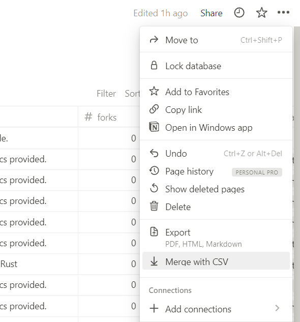

# Информация

Задача скрипта `main.py` - спарсить со страницы пользователя GitHub его репозитории и основную информацию о них, а после сохранить в csv файл. Теперь этот файл можно использовать для создания kanban доски. Например: в [Notion](https://www.notion.so/) можно создать таблицу, и заполнить ее полученными данными при помощи функции `Merge with CSV` (см. скриншот ниже), добавить метки, по типу `Запланировано`, `В работе`, `Готово` и т.д., и получить удобную доску для работы с проектами на GitHub.

## Запуск

1. Склонировать репозиторий `git clone https://github.com/immacool/github-parser.git`
2. Установить зависимости `pip install -r requirements.txt`
3. Запустить скрипт `python main.py --help` для получения справки по аргументам

Пример: `python main.py Textualize -v`

- `Textualize` - имя пользователя (в данном случае организации) на GitHub
- `-v` - выводить подробную информацию в процессе работы
